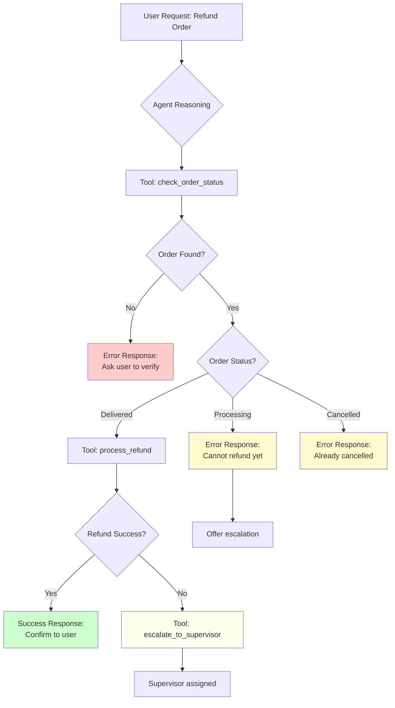
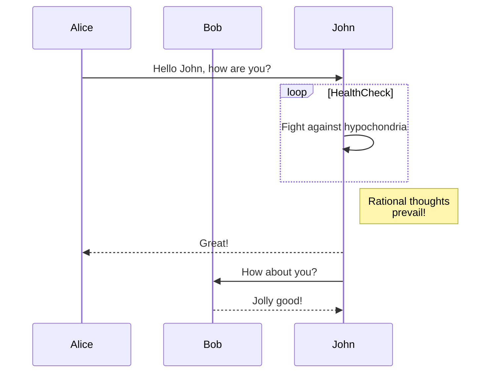

**Flowchart diagram**



**Sequence diagram**



**Error handling**

```mermaid
flowchart TD
      A[Tool Error Received] --> B{Error Type?}
      B -->|temporary_failure| C[Acknowledge<br/>to Customer]
      C --> D[Retry Once]
      D --> E{Success?}
      E -->|Yes| F[Continue Workflow]
      E -->|No| G[Apologize & Ask<br/>to Try Later]
      B -->|not_found| H[Ask User to<br/>Verify Input]
      H --> I[Offer Alternative<br/>Lookup Methods]
      B -->|invalid_format| J[Explain<br/>Correct Format]
      J --> K[Provide<br/>Format Examples]
      B -->|permission_denied| L[Escalate<br/>Immediately]
      B -->|system_error| M[Apologize<br/>Profusely]
      M --> N[Log Error<br/>for Team]
      N --> O[Offer<br/>Callback]

      style L fill:#ffcccc
      style G fill:#fff9cc
      style H fill:#fff9cc
      style J fill:#fff9cc
      style M fill:#ffcccc
      style F fill:#ccffcc
